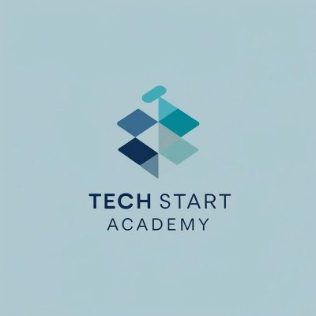

<p align="center">
  
</p>

<h1 align="center">Tech Start Academy</h1>

<p align="center">
  <strong>Plataforma inclusiva de ensino de programação</strong><br>
  Dashboard administrativo · Atividades com correção · Material de 14 linguagens · Chat com IA · Acessibilidade completa
</p>

<p align="center">
  
  
  
  
</p>

---

## 📋 Sobre o Projeto

A **Tech Start Academy** é uma plataforma web completa para ensino de programação, projetada para funcionar **100% no navegador** sem necessidade de backend. Os dados são persistidos diretamente no repositório GitHub via **Contents API**, permitindo deploy gratuito no GitHub Pages com dados reais e atualizados.

Ideal para professores, escolas e projetos educacionais que precisam de uma plataforma funcional sem custos de servidor.

---

## ✨ Funcionalidades

### 👨‍🏫 Área do Professor (Admin)
- **Dashboard** com gráficos e estatísticas em tempo real
- **Correção de atividades** com nota, comentário e código corrigido
- **Gestão de alunos** — cadastro, edição e acompanhamento
- **Atividades de casa** — criação e gerenciamento de tarefas
- **Certificados** — emissão por aluno com upload de PDF
- **Mensagens** — comunicação direta com alunos
- **Configurações** — conexão com GitHub API para persistência

### 👨‍🎓 Área do Aluno
- **Painel** com resumo de notas, atividades e progresso
- **Envio de atividades** com editor de código integrado
- **Material de estudos** com exemplos práticos em 14 tecnologias
- **Chat com IA** — assistente de programação (requer backend opcional)
- **Certificados** — visualização dos certificados recebidos
- **Mensagens** — comunicação com o professor
- **Perfil** — foto, dados pessoais e alteração de senha

### ♿ Acessibilidade
- Temas **Claro** e **Escuro**
- Suporte a **Daltonismo** (Deuteranopia, Protanopia, Tritanopia)
- Modo **Dislexia** com fonte adaptada
- Modo **TDAH** com foco simplificado
- **Tamanho de fonte** ajustável (Normal, Grande, Extra)
- **Texto para Áudio (TTS)** com controle de velocidade
- Integração com **VLibras** para Língua de Sinais
- Navegação por teclado e skip links

---

## 🛠️ Tecnologias

| Camada | Tecnologia |
|--------|-----------|
| Frontend | HTML5, CSS3, JavaScript ES6+ (SPA) |
| Gráficos | Chart.js |
| Persistência | GitHub Contents API + localStorage (cache) |
| Acessibilidade | VLibras, Web Speech API |
| Deploy | GitHub Pages |

---

## 📚 Linguagens no Material de Estudos

<p>
  
  
  
  
  
  
  
  
  
  
  
  
</p>

Python · JavaScript · Java · HTML · CSS · Angular · Spring Boot · Robot Framework · Python OO · TypeScript · React · Node.js · SQL · Git

---

## 🚀 Como Usar

### 1. Clone o repositório

```bash
git clone https://github.com/SEU-USUARIO/TechStartAcademy.git
```

### 2. Ative o GitHub Pages

Vá em **Settings → Pages → Branch: main → Save**

### 3. Configure a persistência

Gere um [Fine-Grained Token](https://github.com/settings/tokens?type=beta) com permissão **Contents (Read and write)** e configure na plataforma em **⚙️ Configurações**.

> 📖 Veja o guia completo de configuração no arquivo `GUIA_CONFIGURACAO_GITHUB.md`

### 4. Acesse a plataforma

```
https://SEU-USUARIO.github.io/TechStartAcademy/
```

---

## 📁 Estrutura do Projeto

```
TechStartAcademy/
├── index.html                  # Página principal (SPA)
├── manifest.json               # Configuração PWA
├── css/
│   └── styles.css              # Estilos completos + acessibilidade
├── js/
│   └── app.js                  # Aplicação completa (GitDB, Auth, Router, Pages)
├── data/
│   ├── tsa_database.json       # Banco de dados (fonte de verdade no GitHub)
│   └── db.json                 # Dados iniciais de referência
├── assets/
│   ├── Logo_Tech_Start_Academy.png
│   └── bot-avatar.svg
├── app.py                      # Backend Flask (opcional, para Chat com IA)
├── send_insights.py            # Script de insights com IA (opcional)
└── requirements.txt            # Dependências Python (opcional)
```

---

## 🔄 Como a Persistência Funciona

```
Usuário faz uma ação (cadastro, envio de atividade, nota...)
              │
              ▼
   Salva no localStorage (instantâneo)
              │
              ▼
   Aguarda 1.5s de inatividade (debounce)
              │
              ▼
   Commit automático via GitHub Contents API
              │
              ▼
   tsa_database.json é atualizado no repositório
              │
              ▼
   Próximo acesso lê os dados atualizados do GitHub
```

---

## 🤖 Backend Opcional (Chat com IA)

O chat com IA requer um backend Python com Google Gemini. Se não precisar do chat, **ignore completamente** — todo o resto funciona sem backend.

```bash
pip install -r requirements.txt
# Configure GEMINI_API_KEY no .env
python app.py
```

---

## 📝 Licença

Este projeto é de uso educacional. Sinta-se livre para usar, modificar e distribuir.

---

<p align="center">
  Feito com 💙 pela <strong>Tech Start Academy</strong>
</p>
